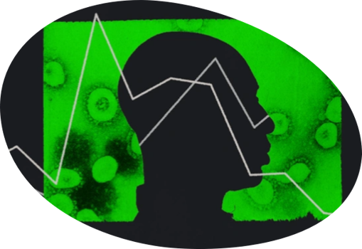

# Women Who Code - Mission: Predictable
__A Virtual Machine Learning Hackathon to Battle Covid-19__

_CDC / GETTY / THE ATLANTIC_

## Project Submission 

* __TEAM:__ #34
* __Student name:__ Sharonda Pettiett-Warner and Omega Markos
* __Submission Date:__ Friday, August 14, 2020

_Your mission, should you choose to accept it, involves forming a team and putting your newfound skills to use in the battle against COVID-19._

## Problem Statement

COVID-19 is a global crisis impacting millions of people world-wide.  Specifically in the US, the disparities between the size of the black population and the percentage of black people infected with, hospitalized with, or dead from COVID-19 appear to be the most severe.

To battle this inequality our team has chosen to build an unsupervised machine learning model using __K-means clustering__ to perform population segmentation and use dimensionality reduction techniques like __PCA__ to evaluate a large number of features.  These features, include US Census Data; US COVID-19 cases, deaths and policies to help us discover new trends and patterns in solving this crisis impacting the black communities in the US.

__COVID-19 Death Rates Higher in Blacks__

__Blacks are dying at a rate higher than all others races in America__
> The share of the Black population is __13%__, while the deaths for Blacks is __22%__ (as of July 22, 2020)

> __31%__ of the States in America are above the National average for Black Deaths (of __22%__ ). 

## The Dataset
Our team analyzed COVID-19 policies, cases and deaths by state and race using the most recent U.S. Census data and the latest information we could gather on COVID-19 events and news articles.

We mined the following datasets to gain insights into this pandemic affecting Black America:

- Policy Datasets: https://docs.google.com/spreadsheets/d/1zu9qEWI8PsOI_i8nI_S29HDGHlIp2lfVMsGxpQ5tvAQ/edit?ts=5f16268f#gid=973655443
https://www.dropbox.com/sh/z8mhrb0r1t4rlqu/AAB3Ykn2uxzffKDnjWJEayz4a/Essential%20businesses?dl=0&subfolder_nav_tracking=1

    - State of Emergency - The date the state declared state of emergency.
    - Physical Distance Closures
    - Stay at Home Policies
    - Reopening businesses dates & policies
    - Second Closures
    - Face Masks
    - Quarantine Rules
    - Alcohol and Firearms
    - Housing
    - Unemployment Insurance
    - Food Security
    - Healthcare Delivery
    - Racial Disparities
    - Incarcerated Individuals
    - Substance Use Disorder Policies
    - Pre-Covid Policies
    - State Characteristics

- Deaths & Population Distributions by Race Dataset:
https://data.cdc.gov/NCHS/Distribution-of-COVID-19-deaths-and-populations-by/jwta-jxbg/
- Cases and Deaths by Race Dataset:
https://docs.google.com/spreadsheets/d/e/2PACX-1vR_xmYt4ACPDZCDJcY12kCiMiH0ODyx3E1ZvgOHB8ae1tRcjXbs_yWBOA4j4uoCEADVfC1PS2jYO68B/pub?gid=43720681&single=true&output=csv

- Computer & Internet Use Dataset:
https://covid19.census.gov/datasets/computer-and-internet-use-counties/data?geometry=138.304%2C-16.868%2C-137.673%2C72.108
- Health insurance Dataset:
https://covid19.census.gov/datasets/health-insurance-coverage-states?geometry=138.304%2C-16.868%2C-137.673%2C72.108
- Language Spoken at Home Dataset:
https://covid19.census.gov/datasets/language-spoken-at-home-counties/data?geometry=138.304%2C-16.868%2C-137.673%2C72.108
- Population Poverty Rates Dataset:
https://covid19.census.gov/datasets/population-and-poverty-states?geometry=138.304%2C-16.868%2C-137.673%2C72.108

> __Dataset Notes:__
- After merging these datasets we arrived at a total of __246__ features by state. 
- All of the datasets were collected as of July 22 2020. 

## Acknowledgements

- Women Who Code, Non-profit organization
- Amazon Web Services, IT service management company (providing the AWS credits)
- Kesha Williams, A Cloud Guru (_Our Guru, for getting us excited about this project, Thanks!_)

# How to Navigate Jupyter Notebooks

> __Order of Navigation:__
- __Part I   :__ Jupyter Notebook: __Battle Covid-19 Project - Data Mining
.ipynb__
- __Part II  :__ Jupyter Notebook: __Battle Covid-19 Project - Data Visualization
.ipynb__
- __Part III :__ Jupyter Notebook: __Battle Covid-19 Project - Machine Learning.ipynb__

# Learning Concepts and Tools

__Data Science Concepts Used:__
- Machine Learning (ML)
- Data Visualization
- Data Cleaning
- Data Exploration
- Feature Engineering

__Tools Used:__
- AWS Sagemaker for developing, training and deploying model via the cloud infrastructure.
- Plotly's Python graphing library makes interactive, publication-quality graphs.

__Machine Learning Models Used:__
- PCA
- K-means Clustering

# Project Summary

## Project Motivation
> Our team spent several days discussing what potential factors were impacting the Black communities in America during this pandemic.   We read that factors such as pre-existing conditions and being a front-line worker were some of the key factors in understanding why Blacks were more infected and more susceptible to dying from the virus.  What we wanted to accomplish in this WWC Battle Covid-19 Hackathon was to use machine learning to uncover more insights into the .... 
_Why?...  And find out, if ... Disasters do Discriminate._ 

## Problem Description
Our analysis found that COVID-19 impacting Black Deaths in __36__ states, is higher than their population share.

## Machine Learning Modeling
To better understand the impact of Black Deaths in the US related to COVID-19, our team analyzed COVID-19 policies, cases and deaths by state and race using the most recent U.S. Census data.  Equipped with more __insightful information__ we chose to use unsupervised machine learning and dimensionality reduction techniques to identify clusters within the datasets to learn, from the properties of the data. 

Our machine learning approach included performing the following key tasks:
- Demonstrating how to build PCA and K-means clustering training models using Sklearn libraries
- Demonstrating how to build and deploy PCA and K-means clustering training models using AWS Sagemaker 

In our evaluation of building PCA model in AWS Sagemaker, we examined the makeup of each PCA component based on the weightings of the original features that are included in the component. For example, the following image shows __PCA Component Makeup: #3__. This component describes attributes of states that have high poverty, __high Black deaths and cases__, high indicators for ending stay at home policies and initiating re-opening mandates. These insights proved to be very valuable for us in the population segmentation process using K-means clustering.  

__PCA Component Makeup: #3__

K-means is a clustering algorithm that identifies clusters of similar states based on their attributes. Since we had __228__ attributes in our original dataset, the large feature space may have made it difficult to cluster the states effectively. Instead, we reduced the feature space to 5 PCA components and implemented K-means algorithm to create (4) clusters.

__K-means |  4 Clusters__

In order to draw conclusions from our model, we evaluated the cluster centers. These centers helped to describe which features were characterize in each cluster. By combining PCA and K-means clustering, the information contained in the model attributes within the trained model, enabled us to gain more insights on the data.

__Combining PCA and K-means__

Using unsupervised learning, we clustered a dataset using K-means after reducing the dimensionality using PCA. By accessing the underlying models created within Amazon SageMaker, we were able to improve the explainability of our modelling and draw actionable conclusions. Using these techniques, we have been able to better understand the characteristics of different states in the US and segment them into groupings accordingly.

Based on our analysis we found Cluster 2, had a high correlation with the PCA component for __BelowPoverty/DeathBlackPercent__.

__Analysis of Cluster 2__

In our analysis of the all of the clusters, we found that __Cluster 2__ best described how blacks in these states were being impacted by COVID-19.  This process revealed new features strongly associated with this segmentation, such as, __high poverty, high Black deaths and cases, high indicators for ending stay at home policies and initiating re-opening mandates.__

__Cluster 2 Data Visualization Insights:__
- Cluster 2: Has the highest Percent living under the federal poverty line (2018) (16%)
- Cluster 2: Has the second most PercentofPopulationwithNoHealthInsuranceCoverage (11%)
- Cluster 2:  Relaxed the the Stay at home policy earlier than the rest of the states based on the number of days after the date of emergency was issued for that state. 
- Cluster 2:  Less social distancing.
- Cluster 2: Has the most Percent Unemployed (2018) (6%)
- Cluster 2: With the lowest (almost none) - This cluster may not be encourged to stay at home when sick because they do not have paid sick leave.
- Cluster 2: Re-open with face masks.
- Cluster 2: Has the lowest percent of housholds with Internet at Home.
- Cluster 2: Less likely to work and learn from home.
- Cluster 2: Re-open businesses earlier than the other states.
- Cluster 2: Did _not_ take advantage of the extra stimulus provided with the Weekly unemployment insurance.

# Battle COVID-19 | Conclusions

This study, _now_ answers our original question - _Do Disasters Discriminate?_   __YES__.

> __Key Findings__
- 41.4% At Risk for serious illness due to COVID-19 (highest)
- 15.47% Households: Income Below Poverty Level (highest)
- 32.39% Deaths_Black (highest)
- 18.4% Cases_Black (highest)
- 15.6% Living under federal poverty line as of 2018 (highest)
- Did not stay at home; Had to participate in the reopenings
- Has high Black Death Percent
- Below Poverty
- Living under Federal Poverty Line

# Battle COVID-19 | Recommendations

The data and our analysis on how COVID-19 is impacting the black communities disproportionately in the United States reveals a link that’s hard to ignore between __race, poverty, cases and deaths__ in America. 

Our analysis demonstrates the following features that are impacted:

__by Government Policies__
- Relaxing stay at home measures
- Initiating early business re-opening
- Obtaining health insurance
- Obtaining paid sick leave

__by Socioeconomic Issues__
- Living under Federal Poverty Line
- Unemployment
- Access to Internet

> These factors _also_ indicate an infrastructure issue in America and the need for having a __National Policy__ on __Health Care and Income Inequities__.

Our recommendations involve having meaningful actions to support these communities and protect public health could include __protective policies for workers, including paid sick leave and provision of health insurance__.  For high poverty and unemployment policymakers should work to address __minimizing the income inequality gap__.

During the pandemic to address poverty and unemployment we need to identify the black populations which need additional access to resources such as __testing, personal protective equipment, education, and support to implement recommended social distancing practices__; support food pantries and meal delivery services for food assistance; and __relief funds are available to the communities most in need__ by streamlining application processes and allowing for __extensions of subsidies when the crisis begins to subside__.

